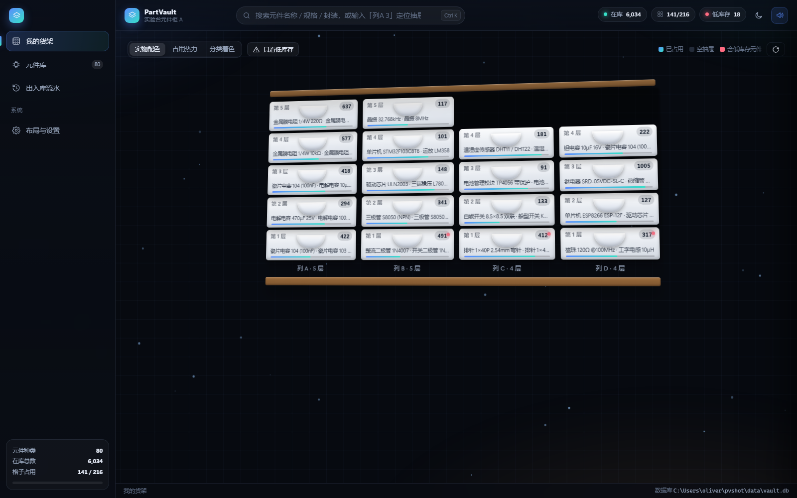

# PartVault · 电子元件收纳管理系统

把你真实的元件柜搬进屏幕：**列 → 抽屉 → 格子 → 元件**。每次取出、放入都自动记一笔账。
面向个人电子爱好者的轻量库存管理 —— 一个微型数据库 + 高度可视化的操作界面。

> 零依赖：不需要 `npm install`，只要有 Node.js。
> 后端 `node:http` + `node:sqlite`（Node 内置），前端原生 JS，无框架、无构建步骤。



## 特性

- **3D 立体货架**：CSS 3D 柜体可拖拽旋转，点抽屉有拉出动画；三种着色模式（实物色 / 库存热力 / 分类色），低于库存阈值自动亮红点
- **格子级库存**：每个抽屉是一块 4×3 格盘，点格子打开侧面板 —— 放入 1/10 个、取出、直接设数量、清空、换元件种类、拖拽挪位、写备注
- **记账**：每次增减都写流水（谁、什么、从哪格、增减前/后数量），按天分组、可按类型筛选、可导出 CSV
- **元件库**：搜索、按分类筛选、排序、低库存只看；可增删改元件种类与最低库存阈值，一键导出 BOM CSV
- **布局编辑器**：可视化加列、加层、改抽屉颜色，格子数自动重建
- **初始化向导**：首次打开 3 步引导，按实物填柜子结构（几列 / 每列几层 / 抽屉内几行几列）
- **数据**：JSON 整体导出/导入（可合并或覆盖）、重置布局、出厂重置
- **离线兜底**：后端不在时（例如直接双击 `index.html`）自动降级为浏览器 localStorage，界面照样能用
- 深色/浅色主题、WebAudio 合成音效、命令面板、全局搜索

## 快速开始

### 环境要求

| 项 | 说明 |
|---|---|
| Node.js | **22.5 或更高**（必需，`node:sqlite` 从这个版本开始内置） |
| 推荐版本 | **22.13+ / 23.4+ / 24+**（这些版本不再需要 `--experimental-sqlite`） |
| npm | 不需要，项目零依赖 |
| 数据库 | 不需要单独安装，就是一个 `.db` 文件 |

> 如果你正好在 **22.5 ~ 22.12** 之间：这几个版本里 `node:sqlite` 藏在 `--experimental-sqlite` 后面。
> 程序会自己检测并带上该参数重启一次，**你不用手动做任何事**。想彻底避开就升到 22.13+。

```bash
# 1. 确认 Node 版本
node -v

# 2. 启动（零依赖，无需 install）
node --no-warnings server.js --open
```

或者直接：

- **Windows**：双击 `start.bat`
- **Linux / macOS**：`bash start.sh`

浏览器会自动打开 `http://127.0.0.1:7788/`。端口被占用时会自动 +1。

## 数据存放位置（重要）

SQLite 需要**文件级锁**，而网络文件系统（WSL 的 9p、SMB 共享盘）拿不到锁，会直接报
`database is locked`。所以启动时会有一次「落盘目录探测」，依次尝试：

1. `$PV_DATA_DIR`（环境变量）
2. `<项目目录>/data`
3. `%LOCALAPPDATA%\PartVault`（Windows）/ `~/.partvault`
4. 系统临时目录

挑第一个**能写、能起事务**的位置存放 `vault.db`，并在启动日志里打印实际路径。
PRAGMA 固定用 `journal_mode = DELETE` + `busy_timeout = 8000`（**不用 WAL**，WAL 在网络文件系统上必炸）。

> 典型场景：项目源码放在 WSL 目录，数据库落在 Windows 本地盘 —— 这是预期行为。

想指定位置就设环境变量：

```bash
PV_DATA_DIR=/path/to/dir node --no-warnings server.js
```

## 项目结构

```
server.js              零依赖后端：HTTP 服务 + SQLite + REST API + 种子数据
package.json           只有一个 engines 约束，无 dependencies
start.bat / start.sh   启动脚本（自动找 Node、校验版本、指定数据目录）

public/
  index.html           页面骨架 + SVG 图标精灵
  css/style.css        全部样式：3D 柜体 / 抽屉 / 托盘格 / 双主题
  js/util.js           h() 元素构造器、图标、Toast、音效、Modal/Sheet、粒子背景、偏好存储
  js/store.js          REST 在线模式 + localStorage 离线引擎，对外统一接口
  js/components.js     纯 SVG 手绘元件图（按分类画电容/电阻色环/IC/晶振/排针…）
  js/views/cabinet.js  3D 柜体总览
  js/views/drawer.js   抽屉俯视格盘 + 格子操作面板
  js/views/parts.js    元件库
  js/views/moves.js    出入库流水
  js/views/settings.js 设置、库存概览、数据管理、布局编辑器、初始化向导
  js/app.js            路由、导航、全局搜索、命令面板、快捷键

preview/               成品截图
```

## 数据模型

| 表 | 说明 |
|---|---|
| `meta` | 键值配置（柜子名、操作人、主题、是否已初始化…） |
| `categories` | 元件分类（名称/图标/颜色/排序） |
| `parts` | 元件种类（编号 `PV-0001`、名称、规格、封装、单位、颜色、最低库存） |
| `stacks` | 柜子的一**列** |
| `drawers` | 一个抽屉，归属某列、某层 |
| `cells` | 一个**格子**，归属某抽屉，行/列坐标 + 当前放的元件 + 数量 |
| `moves` | 流水：类型 + 元件 + 格子 + 增减数量 + 增减前后库存 |

预置种子数据：12 个分类、80 种常见元件、4 列 / 18 抽屉 / 216 格。

## REST API

| 方法 | 路径 | 说明 |
|---|---|---|
| GET | `/api/health` | 健康检查，返回数据库真实路径 |
| GET | `/api/bootstrap` | 一次性拉全量数据（分类/元件/布局/格子），前端启动用 |
| GET | `/api/stats` | 统计：种类数、总件数、占用格数、低库存清单、按分类占比 |
| GET | `/api/search?q=` | 全局搜索（元件名/规格/封装/编号/位置） |
| GET | `/api/moves` | 流水列表 |
| GET | `/api/drawers/:id` | 单个抽屉的全部格子 |
| POST | `/api/cells/op` | **单格操作**，见下方说明 |
| POST | `/api/cells/:id` | 同上，只是把 `cell_id` 放进 URL |
| POST | `/api/cells/batch` | 批量格子操作（body：`{ ops: [...] }`） |
| GET / POST | `/api/categories` | 分类列表 / 新建 |
| PUT / DELETE | `/api/categories/:id` | 改 / 删分类 |
| GET / POST | `/api/parts` | 元件列表 / 新建 |
| PUT / DELETE | `/api/parts/:id` | 改 / 删元件种类 |
| GET / POST | `/api/layout` | 布局结构 / 重建布局 |
| POST | `/api/meta` | 写配置 |
| GET / POST | `/api/export` `/api/import` | 备份导出 / 导入（`mode: merge \| replace`） |
| POST | `/api/reset` | 清空库存与流水（保留元件库） |
| POST | `/api/factory-reset` | 出厂重置 |

### `POST /api/cells/op` 单格操作

body 里用 **`op`** 字段（不是 `kind`）指定动作：

| `op` | 作用 | 需要带的字段 |
|---|---|---|
| `ASSIGN` | 给空格子指定元件种类并放入若干（**首次上架用这个**） | `cell_id` `part_id` `qty` |
| `IN` | 往已有元件的格子里补货 | `cell_id` `qty` |
| `OUT` | 取出（自动封顶，不会取成负数） | `cell_id` `qty` |
| `SET` | 直接把库存改成某个数 | `cell_id` `qty` |
| `CLEAR` | 清空格子（元件不再占用该格） | `cell_id` |
| `MOVE` | 把整格挪到另一个格子（目标格必须为空或同种元件） | `cell_id` `target_cell_id` |

可选字段：`note`（备注）、`ts`（自定义时间）。

```bash
# 首次上架：1 号格放 25 个 1 号元件
curl -X POST http://127.0.0.1:7788/api/cells/op \
  -H 'Content-Type: application/json' \
  -d '{"op":"ASSIGN","cell_id":1,"part_id":1,"qty":25,"note":"新手上架"}'

# 取出 10 个
curl -X POST http://127.0.0.1:7788/api/cells/op \
  -H 'Content-Type: application/json' \
  -d '{"op":"OUT","cell_id":1,"qty":10}'
```

返回 `{"ok":true,"cell_id":1,"part_id":1,"before":25,"after":15}`。

## 快捷键

| 键 | 作用 |
|---|---|
| `1` `2` `3` `4` | 切换到 货架 / 元件库 / 流水 / 设置 |
| `/` | 聚焦全局搜索 |
| `Ctrl + K`（macOS `⌘ K`） | 命令面板 |
| `Esc` | 关闭面板 / 清空搜索 |

## 技术选择

调研过 InvenTree、Part-DB、PartKeepr —— InvenTree 偏制造与 BOM、部署重；Part-DB 需要 PHP 环境；PartKeepr 已停更。都不太贴合「自用小仓库 + 实物可视化」，因此自研此零依赖版本：**不带 `node_modules`，一条命令就能跑，数据库就是一个文件，拷贝走即备份。**

## License

MIT
